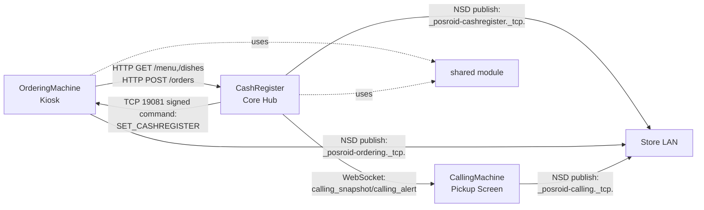

# ComposeXPOS 架构与开源亮点 (Architecture & Open-Source Highlights)

ComposeXPOS 是一个基于 Kotlin Multiplatform + Compose 构建的**多终端 POS 套件**。
它把门店核心流程拆成三台协同设备并在同一仓库维护：

- `orderingMachine`（自助点餐机 / Kiosk）
- `cashRegister`（收银端 + 局域网订单中枢）
- `callingMachine`（取餐叫号屏）
- `shared`（跨模块共享模型 + 开源安全版支付/打印适配）

## 为什么这个项目值得关注 (Why This Project Matters)

- 一个仓库覆盖端到端 POS 场景（点餐、收银、叫号）。
- LAN 优先设计（HTTP + WebSocket + NSD），贴合门店本地网络部署。
- 默认开源安全：支付与打印为 mock 模式，不包含生产密钥和敏感凭据。
- 多设备协同是架构核心，而不是后期拼接。

## 架构总览 (Architecture At A Glance)

## 模块职责 (Module Responsibilities)

| Module | Primary role | Key capabilities | Typical entry points |
|---|---|---|---|
| `orderingMachine` | Customer-facing kiosk | Full-screen ordering flow, menu sync, card/counter payment flow, post order to cashier | `MainActivity`, `CashRegisterClient`, `MainViewModel.*` |
| `cashRegister` | Store control hub | Order API server (`:8080`), menu source, call-number lifecycle, printing hooks, calling-machine bridge | `MainActivity`, `LanOrderServer`, `OrdersRepository`, `CallingMachineBridge`, `CallingRepository` |
| `callingMachine` | Pickup status display | Real-time preparing/ready board, voice/TTS alerts, WebSocket receiver (`:9090`) | `MainActivity`, `CallingWebSocketServer`, `CallingState` |
| `shared` | Reusable cross-app library | Unified order models, payment mock client, POS trigger mock client, mock feature notices | `shared/network/OrderModels.kt`, `shared/payment/wecr/*`, `shared/mock/MockFeatureNotice.kt` |

## 核心业务流 (Order -> Pickup)

1. `orderingMachine` syncs menu from `cashRegister` (`GET /menu`, `GET /dishes`).
2. Customer places order and chooses payment method (card/counter).
3. `orderingMachine` posts order payload to `cashRegister` (`POST /orders`).
4. `cashRegister` normalizes status and assigns/reserves call number for kiosk orders.
5. Order is persisted and print hooks run (mock print in open-source mode).
6. `cashRegister` pushes calling snapshot to `callingMachine` via WebSocket.
7. `callingMachine` updates preparing/ready lists and can play beep/TTS alerts.

## 技术特征 (Technical Highlights)

- **Service discovery and pairing**
  - NSD service types for cashier/ordering/calling roles.
  - Signed remote config command for OrderingMachine endpoint setup.
- **Reliable local networking**
  - Retry/backoff in kiosk -> cashier HTTP client.
  - Auto-reconnect logic in cashier -> calling WebSocket client.
- **Call number lifecycle**
  - `reserved`, `preparing`, `ready` states with daily reset behavior.
- **Operational readiness**
  - Boot receivers for kiosk/cashier/calling startup.
  - Crashlytics instrumentation across major modules.
- **Store UX features**
  - Multi-language support (`EN`, `ZH`, `NL`, `JA`, `TR`).
  - Allergen and customization metadata propagated through order payloads.
  - Customer display integration hooks in cashier module.

## 安全边界 (Security And Trust Boundaries)

- Calling WebSocket uses signed handshake params (`ts` + `sig`) with timestamp window validation.
- Ordering remote config uses signed command digest with timestamp and device UUID.
- Open-source branch does **not** include production payment keys, merchant credentials, or live printer endpoints.

## 开源模式说明 (Open-Source Mode)

This repository currently runs in **mock payment + mock printing** mode for safe public distribution.

- Payment actions return simulated success/cancel responses.
- Print actions emit mock behavior and user-visible notices.
- Integration guide: `docs/OPEN_SOURCE_PAYMENT_PRINTING.md`

Recommended production integration points:

- `shared/src/commonMain/kotlin/com/cofopt/shared/payment/wecr/WecrHttpsClient.kt`
- `shared/src/commonMain/kotlin/com/cofopt/shared/payment/wecr/WecrTcpClient.kt`
- `cashRegister/src/androidMain/kotlin/com/cofopt/cashregister/printer/PrintUtils.kt`
- `orderingMachine/src/androidMain/kotlin/com/cofopt/orderingmachine/ui/PaymentScreen/OrderPrint.kt`

## 平台策略 (Platform Strategy)

- Android is the current full-feature runtime path.
- iOS and Web entry points are present for each app module via Compose Multiplatform targets.
- `commonMain` contains shared app entry scaffolds that can be expanded toward feature parity.

## 贡献方向 (Contributor Opportunities)

High-impact contribution directions:

1. Real payment provider adapter and secure credential injection.
2. Real printer transports (USB/IP/vendor SDK) with delivery acknowledgements.
3. Stronger observability (structured logs, metrics, trace correlation across devices).
4. CI + contract tests for kiosk/cashier/calling integration.
5. Production hardening for auth, key rotation, and device provisioning.

---

If you are evaluating this repo for adoption:
start with `cashRegister` as the hub, then trace `orderingMachine -> /orders -> callingMachine` to understand the full device collaboration path.
