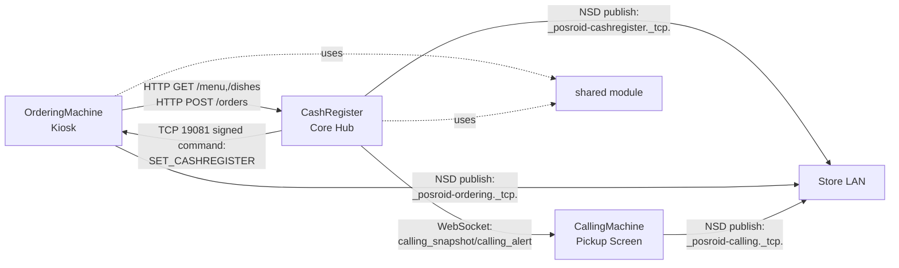

# ComposeXPOS Architecture & Open-Source Highlights

ComposeXPOS is a **multi-device POS suite** built with Kotlin Multiplatform + Compose.
It splits core store workflows into three collaborative devices and maintains them in one repository:

- `orderingMachine` (self-service kiosk)
- `cashRegister` (cashier app + LAN order hub)
- `callingMachine` (pickup calling display)
- `shared` (cross-module shared models + open-source-safe payment/printing adapters)

## Why This Project Matters

- One repository covers the full POS flow (ordering, cashiering, pickup calling).
- LAN-first design (HTTP + WebSocket + NSD), aligned with in-store local network deployment.
- Open-source-safe defaults: payment and printing run in mock mode with no production secrets.
- Multi-device collaboration is a first-class architecture concern, not an afterthought.

## Architecture At A Glance

## Module Responsibilities

| Module | Primary Role | Key Capabilities | Typical Entry Points |
|---|---|---|---|
| `orderingMachine` | Customer-facing kiosk | Full-screen ordering flow, menu sync, card/counter payment flow, submit order to cashier | `MainActivity`, `CashRegisterClient`, `MainViewModel.*` |
| `cashRegister` | Store control hub | Order API server (`:8080`), menu source, call-number lifecycle, printing hooks, calling-machine bridge | `MainActivity`, `LanOrderServer`, `OrdersRepository`, `CallingMachineBridge`, `CallingRepository` |
| `callingMachine` | Pickup status display | Real-time preparing/ready board, voice/TTS alerts, WebSocket receiver (`:9090`) | `MainActivity`, `CallingWebSocketServer`, `CallingState` |
| `shared` | Reusable cross-app library | Unified order models, payment mock client, POS trigger mock client, mock feature notices | `shared/network/OrderModels.kt`, `shared/payment/wecr/*`, `shared/mock/MockFeatureNotice.kt` |

## Core Business Flow (Order -> Pickup)

1. `orderingMachine` syncs menu from `cashRegister` (`GET /menu`, `GET /dishes`).
2. The customer places an order and selects a payment method (card/counter).
3. `orderingMachine` posts order payloads to `cashRegister` (`POST /orders`).
4. `cashRegister` normalizes status and assigns/reserves call numbers for kiosk orders.
5. Orders are persisted and print hooks run (mock printing in open-source mode).
6. `cashRegister` pushes calling snapshots to `callingMachine` via WebSocket.
7. `callingMachine` updates preparing/ready lists and can play beep/TTS alerts.

## Technical Highlights

- **Service discovery and pairing**
  - NSD service types for cashier/ordering/calling roles.
  - Signed remote config command for OrderingMachine endpoint setup.
- **Reliable local networking**
  - Retry/backoff in kiosk -> cashier HTTP client.
  - Auto-reconnect logic in cashier -> calling WebSocket client.
- **Call number lifecycle**
  - `reserved`, `preparing`, `ready` states with daily reset behavior.
- **Operational readiness**
  - Boot receivers for kiosk/cashier/calling startup.
  - Built-in mock notices for open-source flows (payment/printing).
- **Store UX features**
  - Multi-language support (`EN`, `ZH`, `NL`, `JA`, `TR`).
  - Allergen and customization metadata propagated through order payloads.
  - Customer display integration hooks in the cashier module.

## Security And Trust Boundaries

- Calling WebSocket supports signed handshake parameters (`ts` + `sig`) with timestamp-window validation.
- Ordering remote config uses a signed command digest with timestamp and device UUID.
- The open-source branch does **not** include production payment keys, merchant credentials, or live printer endpoints.

## Open-Source Mode

This repository currently runs in **mock payment + mock printing** mode for safe public distribution.

- Payment actions return simulated success/cancel responses.
- Print actions emit mock behavior and user-visible notices.
- Integration guide: `docs/OPEN_SOURCE_PAYMENT_PRINTING.md`

Recommended production integration points:

- `shared/src/commonMain/kotlin/com/cofopt/shared/payment/wecr/WecrHttpsClient.kt`
- `shared/src/commonMain/kotlin/com/cofopt/shared/payment/wecr/WecrTcpClient.kt`
- `cashRegister/src/androidMain/kotlin/com/cofopt/cashregister/printer/PrintUtils.kt`
- `orderingMachine/src/androidMain/kotlin/com/cofopt/orderingmachine/ui/PaymentScreen/OrderPrint.kt`

## Platform Strategy

- Android is the current full-feature runtime path.
- iOS and Web entry points are present for each app module via Compose Multiplatform targets.
- `commonMain` contains shared app entry scaffolds that can be expanded toward feature parity.

## Contributor Opportunities

High-impact contribution directions:

1. Real payment provider adapter and secure credential injection.
2. Real printer transports (USB/IP/vendor SDK) with delivery acknowledgements.
3. Stronger observability (structured logs, metrics, trace correlation across devices).
4. CI + contract tests for kiosk/cashier/calling integration.
5. Production hardening for authentication, key rotation, and device provisioning.

---

If you are evaluating this repository for adoption, start from `cashRegister` as the hub, then trace `orderingMachine -> /orders -> callingMachine` to understand the full device collaboration path.
