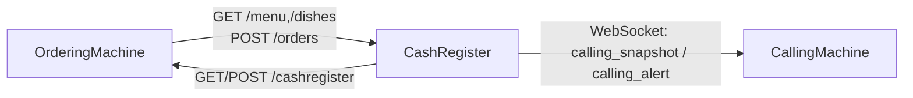

# 🍟 ComposeXPOS - Open Source Compose Multiplatform POS System

<div align="center">

A LAN-first **Compose Multiplatform POS Suite** for Android / iOS / Web.


</div>

ComposeXPOS is an open-source **restaurant POS system** built with **Kotlin Multiplatform** and **Compose Multiplatform**.
It provides a complete **self-order kiosk + cashier + pickup calling screen** workflow for **Android, iOS, and Web** deployments.

## Live Preview (Web version)

- Home: [https://composexpos.site/](https://composexpos.site/)
- OrderingMachine Instance A: [https://composexpos.site/orderingMachine/](https://composexpos.site/orderingMachine/)
- OrderingMachine Instance B: [https://composexpos.site/orderingMachine-1/](https://composexpos.site/orderingMachine-1/)
- CashRegister: [https://composexpos.site/cashRegister/](https://composexpos.site/cashRegister/)
- CallingMachine: [https://composexpos.site/callingMachine/](https://composexpos.site/callingMachine/)

## 🔍 Keywords

`Kotlin Multiplatform POS`, `Compose Multiplatform POS`, `Open Source POS`, `Restaurant POS`, `Self-Order Kiosk`, `Cash Register App`, `Pickup Calling Screen`, `LAN POS System`, `Android POS`, `iOS POS`, `Web POS`

## Table of Contents

- [Overview](#overview)
- [Live Preview](#live-preview)
- [Features](#features)
- [Use Cases](#use-cases)
- [Modules](#modules)
- [Architecture](#architecture)
- [Why Local-First Instead of Cloud-First](#why-local-first-instead-of-cloud-first)
- [Current Platform Targets](#current-platform-targets)
- [Quick Start](#quick-start)
- [iOS Host App (Xcode)](#ios-host-app-xcode)
- [LAN APIs and Protocols](#lan-apis-and-protocols)
- [Connection Design and Usage Guide](#connection-design-and-usage-guide)
- [Open-Source Safety Notes](#open-source-safety-notes)
- [Development Environment](#development-environment)
- [GitHub Pages Web Preview](#github-pages-web-preview)
- [Roadmap](#roadmap)
- [Contributing](#contributing)

## Overview

ComposeXPOS is a multi-device POS project with three apps and one shared module:

- `orderingMachine`: customer-facing kiosk
- `cashRegister`: cashier hub (orders, menu sync, call-number control)
- `callingMachine`: pickup calling display
- `shared`: cross-module protocols, models, and common capabilities

Current project mode: **open-source safe mode**. Payment and printing run in mock flows by default, with no production secrets in the repository.

## Features

- Multi-app POS workflow: kiosk ordering, cashier processing, and pickup calling display
- LAN-first local networking with HTTP/WebSocket for in-store deployments
- Kotlin Multiplatform codebase with Compose UI across Android, iOS, and Web
- Open-source-safe defaults: mock payment and mock printing flows
- Service-oriented module design for easier production adapter integration

## Use Cases

- Restaurant, cafe, and fast-food in-store ordering systems
- Self-service kiosk + cashier collaboration on local network
- Pickup number boards and kitchen-to-front-desk call coordination
- Reference architecture for Compose Multiplatform enterprise apps

## Modules

| Module | Role | Core Capabilities |
|---|---|---|
| `:orderingMachine` | Kiosk | Menu display, cart, checkout, payment flow (mock) |
| `:cashRegister` | Cashier hub | LAN API, order management, menu sync, calling integration |
| `:callingMachine` | Calling display | Real-time preparing/ready status board, alert linkage |
| `:shared` | Shared library | Protocol models, network constants, common logic |

## Architecture



## Why Local-First Instead of Cloud-First

ComposeXPOS is intentionally designed as a **local-first communication system** for in-store operations.

In high-throughput environments (for example, fast-food restaurants at peak hours), local communication provides clear operational advantages over cloud-only message paths:

- **Lower latency for critical actions**  
  Orders, queue state updates, and calling-screen refreshes stay inside the local network instead of crossing WAN links.
- **Higher stability under crowded customer networks**  
  Guest Wi-Fi congestion and mobile carrier variability affect cloud roundtrips much more than local device-to-device traffic on a dedicated store LAN.
- **Better resilience during internet degradation/outage**  
  Core in-store flows can continue even if external internet quality drops.
- **Predictable real-time behavior**  
  CallingMachine updates (`calling_snapshot` / `calling_alert`) are more deterministic when synchronized directly from CashRegister over LAN/WebSocket.
- **Lower external dependency and cost pressure**  
  Day-to-day store operations do not depend on always-on cloud brokers for every state transition.

This does **not** mean cloud is unnecessary. Cloud services are still useful for:

- cross-store reporting and analytics
- centralized management and backups
- remote monitoring/operations

Practical model: keep **real-time operational control local-first**, and sync non-real-time business data to cloud asynchronously.

## Current Platform Targets

- ✅ Android
- ✅ iOS
- ✅ Web

## Quick Start

### 1) Build Android

```bash
./gradlew :callingMachine:assembleDebug :cashRegister:assembleDebug :orderingMachine:assembleDebug
```

### 2) Run Web Dev Server

```bash
./gradlew :callingMachine:jsBrowserDevelopmentRun
./gradlew :cashRegister:jsBrowserDevelopmentRun
./gradlew :orderingMachine:jsBrowserDevelopmentRun
```

### 3) Build Web Distribution

```bash
./gradlew :callingMachine:jsBrowserDistribution
./gradlew :cashRegister:jsBrowserDistribution
./gradlew :orderingMachine:jsBrowserDistribution
```

### 4) Build iOS Frameworks (Simulator)

```bash
./gradlew :callingMachine:linkDebugFrameworkIosSimulatorArm64
./gradlew :cashRegister:linkDebugFrameworkIosSimulatorArm64
./gradlew :orderingMachine:linkDebugFrameworkIosSimulatorArm64
```

## iOS Host App (Xcode)

Use: `iosApp/iosApp.xcodeproj`

Shared schemes:

- `Calling` (`Debug-Calling`)
- `Cash` (`Debug-Cash`)
- `Ordering` (`Debug-Ordering`)

Related configs:

- `iosApp/Configuration/Config-Calling.xcconfig`
- `iosApp/Configuration/Config-Cash.xcconfig`
- `iosApp/Configuration/Config-Ordering.xcconfig`

## LAN APIs and Protocols

### CashRegister API

- `GET /health`
- `GET /dishes`
- `GET /menu`
- `POST /orders`

### OrderingMachine Config API

- `GET /health`
- `GET /cashregister`
- `POST /cashregister`
- Header auth: `X-ComposeXPOS-Key: <COMPOSEXPOS_LINK_SHARED_KEY>`

### CallingMachine WebSocket

- Viewer: `?mode=viewer`
- Source:
  - Required: `?mode=source&key=<CALLING_WS_SHARED_KEY>`
  - Optional hardening: `&ts=<millis>&sig=<sha256>`

Default placeholder key location:

- `shared/src/commonMain/kotlin/com/cofopt/shared/network/ComposeXPOSLinkProtocol.kt`

## Connection Design and Usage Guide

### 1) Topology and Link Direction

ComposeXPOS uses a LAN-first topology with explicit app roles:

- `orderingMachine -> cashRegister`: order submission and menu retrieval over HTTP
- `cashRegister -> orderingMachine`: remote endpoint configuration (`/cashregister`) for Android OrderingMachine
- `cashRegister -> callingMachine`: real-time queue synchronization over WebSocket (`calling_snapshot` / `calling_alert`)

### 2) Discovery Strategy by Platform

#### Android CashRegister

- Uses NSD (DNS-SD) to discover:
  - `_composexpos-ordering._tcp.`
  - `_composexpos-calling._tcp.`
- Resolves IPv4 endpoints from service attributes/host data.
- Supports manual target override in Debug tools.

#### Web CashRegister

- Browsers do not provide native NSD APIs, so discovery is active-probe based.
- Discovery combines:
  - saved/manual host+port hints
  - current page host and loopback/emulator hosts
  - LAN prefix scanning (including common private prefixes and WebRTC-assisted hints when available)
- Ordering probes use `/composexpos-ordering.json` and `/health`.
- Calling probes use WebSocket viewer reachability checks.
- Manual connection is always available and should be used as a fallback when browser network policies limit discovery.
- On HTTPS pages, browser mixed-content and private-network policies can block `http://` and `ws://` LAN probes.
  - For stable public-web deployments, use HTTPS/WSS reverse-proxy targets on port `443`.

#### Advertising

- Android OrderingMachine advertises ordering service via NSD and serves discovery/config endpoints.
- Android CallingMachine advertises calling service via NSD.
- Web instances are discoverable by probe behavior (HTTP/WebSocket responses), not by NSD broadcast.

### 3) Manual Connection and Disconnect Behavior

#### OrderingMachine targets

- Android OrderingMachine supports full remote configuration:
  - `POST /cashregister` with shared-key auth
- Web OrderingMachine instances do not expose `/cashregister` config API.
  - CashRegister can still select them as communication targets.
  - UI will label them as `Web instance (no /cashregister API)`.
- `Disconnect` removes current logical binding from CashRegister-side connected target state.

#### CallingMachine targets

- CashRegister (Android/Web) supports `Manual Host`, `Manual Port`, and `Use Manual Target`.
- `Disconnect` is available for active CallingMachine links.
- CallingMachine UI shows local address information to simplify manual linking:
  - CallingMachine top area: `Local IP`
  - OrderingMachine System Info: `Local IP`

### 4) Port and Endpoint Conventions

Common defaults and conventions used by the current implementation:

- CallingMachine WebSocket server: `9090`
- OrderingMachine Android presence/config server: `19081`
- HTTPS/WSS reverse-proxy gateway (recommended for public web): `443`
- OrderingMachine Web dev instances: commonly `19082`, plus common dev ports (`3000`, `3001`, `4173`, `5173`, `5174`, etc.)
- CashRegister LAN API default endpoint in local setups: commonly `:8080`

Core endpoints:

- OrderingMachine:
  - `GET /health`
  - `GET /composexpos-ordering.json`
  - `GET /cashregister`
  - `POST /cashregister` (Android implementation)
- CallingMachine:
  - WebSocket with `mode=viewer` or `mode=source`

### 5) Authentication and Trust Model

#### OrderingMachine config push

- `POST /cashregister` requires shared-key authentication.
- Accepted key input:
  - Header: `X-ComposeXPOS-Key`
  - Request body: `sharedKey`
- Expected value: `COMPOSEXPOS_LINK_SHARED_KEY`

#### CallingMachine source link

- Source role requires:
  - `mode=source`
  - `key=<CALLING_WS_SHARED_KEY>`
- Optional request-signature hardening is supported with:
  - `ts=<millis>`
  - `sig=sha256("CALLING_WS_V1|<ts>|<CALLING_WS_SHARED_KEY>")`
- Viewer role (`mode=viewer`) is read-only and cannot publish snapshots/alerts.

All default shared keys are placeholder values in:

- `shared/src/commonMain/kotlin/com/cofopt/shared/network/ComposeXPOSLinkProtocol.kt`

### 6) Localhost, LAN IP, and Multi-Instance Rules

- `localhost` always points to the device running the current app.
  - If two apps are on different devices, do not use `localhost` for cross-device links.
  - Use the target device `Local IP` shown in UI.
- Multiple app instances on the same host are differentiated by port and service instance identity.
  - Example: same IP with different ports is treated as different targets.
- For local multi-instance testing, start each instance on a unique port and connect by `host:port`.

### 7) Troubleshooting Checklist

- `ERROR:network_unreachable`
  - Verify host is reachable from the current device (not wrong `localhost` scope).
  - Use target device `Local IP` + correct port.
  - If CashRegister runs on `https://...`, do not target raw `http://`/`ws://` LAN endpoints directly from browser.
    - Use reverse proxy over `https://` / `wss://` on `443`.
- `no /cashregister API`
  - Expected when target is a Web OrderingMachine instance.
  - Selection is still valid; remote config push is simply unavailable.
- `0 discovered` on Web
  - Browser private-network/CORS/HTTPS policies may block discovery probes.
  - Use manual target input.
- Validate endpoint directly:
  - LAN/direct: `http://<host>:<port>/health`
  - LAN/direct: `http://<host>:<port>/composexpos-ordering.json`
  - Reverse proxy: `https://<host>/health`
  - Reverse proxy: `https://<host>/composexpos-ordering.json`

### 8) HTTPS + Reverse Proxy Deployment (Fastest Production-Friendly Web Setup)

Recommended mapping (example):

- `wss://call-xxx.composexpos.site` -> reverse proxy -> `ws://<ANDROID_CALLING_LAN_IP>:9090`
- `https://ord-xxx.composexpos.site` -> reverse proxy -> `http://<ANDROID_ORDERING_LAN_IP>:19081`

CashRegister Web should connect to these public TLS endpoints (port `443`) instead of direct LAN `http/ws`.

Manual input examples in CashRegister Debug:

- CallingMachine:
  - `Manual Host`: `wss://call-xxx.composexpos.site` (or `call-xxx.composexpos.site`)
  - `Manual Port`: `443` (or leave empty when scheme already implies `443`)
- OrderingMachine:
  - `Manual Host`: `https://ord-xxx.composexpos.site` (or `ord-xxx.composexpos.site`)
  - `Manual Port`: `443` (or leave empty when scheme already implies `443`)

Notes:

- Browser auto-discovery is best-effort and LAN-focused; it is not a replacement for NSD across public internet.
- For multi-instance environments, always differentiate targets by host + port (or subdomain), even when they resolve to the same gateway IP.
- Keep `X-ComposeXPOS-Key` enabled end-to-end on `POST /cashregister` for secure remote config push.

## Open-Source Safety Notes

- Firebase dependencies and config have been removed from this repository.
- Never commit real certificates, keys, merchant credentials, or production endpoints.
- Replace placeholder configs through secure runtime injection in production environments.

Production payment/printing integration reference:

- `docs/OPEN_SOURCE_PAYMENT_PRINTING.md`

## Development Environment

- JDK 17+
- Android SDK (`sdk.dir` configured in local `local.properties`)
- Xcode (required only when building the iOS host app)

## GitHub Pages Web Preview

This repo includes a workflow at:

- `.github/workflows/deploy-web.yml`

It automatically builds and deploys all web apps to GitHub Pages on every push to `main`:

- `orderingMachine`
- `orderingMachine-1` (same build as orderingMachine, labeled as Instance B)
- `cashRegister`
- `callingMachine`

### Enable once in GitHub

1. Open your repo on GitHub.
2. Go to **Settings → Pages**.
3. In **Build and deployment**, set **Source = GitHub Actions**.

Live preview links are listed at the beginning of this document in [Live Preview](#live-preview).

Important:

- GitHub Pages only hosts static web assets. It does not expose Android device LAN APIs/WebSockets by itself.
- To connect web clients to Android OrderingMachine/CallingMachine across networks, deploy a separate reverse proxy/gateway with TLS.

## Roadmap

- [ ] Production-grade payment gateway adapter
- [ ] Production-grade printing channels (USB/IP/vendor SDK)
- [ ] End-to-end integration testing and CI hardening
- [ ] Multi-device deployment and key-rotation automation

## Contributing

Pull requests and issues are welcome.

Recommended local check before submitting:

```bash
./gradlew :callingMachine:compileDebugKotlinAndroid :cashRegister:compileDebugKotlinAndroid :orderingMachine:compileDebugKotlinAndroid
```
