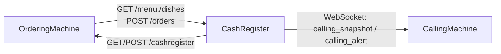

# 🍟 ComposeXPOS

<div align="center">

A LAN-first **Compose Multiplatform POS Suite** for Android / iOS / Web.


</div>

## ✨ Overview

ComposeXPOS is a multi-device POS project with three apps and one shared module:

- `orderingMachine`: customer-facing kiosk
- `cashRegister`: cashier hub (orders, menu sync, call-number control)
- `callingMachine`: pickup calling display
- `shared`: cross-module protocols, models, and common capabilities

Current project mode: **open-source safe mode**. Payment and printing run in mock flows by default, with no production secrets in the repository.

## 📦 Modules

| Module | Role | Core Capabilities |
|---|---|---|
| `:orderingMachine` | Kiosk | Menu display, cart, checkout, payment flow (mock) |
| `:cashRegister` | Cashier hub | LAN API, order management, menu sync, calling integration |
| `:callingMachine` | Calling display | Real-time preparing/ready status board, alert linkage |
| `:shared` | Shared library | Protocol models, network constants, common logic |

## 🧭 Architecture



## 🌐 Current Platform Targets

- ✅ Android
- ✅ iOS
- ✅ Web

## 🚀 Quick Start

### 1) Build Android

```bash
./gradlew :callingMachine:assembleDebug :cashRegister:assembleDebug :orderingMachine:assembleDebug
```

### 2) Run Web Dev Server

```bash
./gradlew :callingMachine:jsBrowserDevelopmentRun
./gradlew :cashRegister:jsBrowserDevelopmentRun
./gradlew :orderingMachine:jsBrowserDevelopmentRun
```

### 3) Build Web Distribution

```bash
./gradlew :callingMachine:jsBrowserDistribution
./gradlew :cashRegister:jsBrowserDistribution
./gradlew :orderingMachine:jsBrowserDistribution
```

### 4) Build iOS Frameworks (Simulator)

```bash
./gradlew :callingMachine:linkDebugFrameworkIosSimulatorArm64
./gradlew :cashRegister:linkDebugFrameworkIosSimulatorArm64
./gradlew :orderingMachine:linkDebugFrameworkIosSimulatorArm64
```

## 🧩 iOS Host App (Xcode)

Use: `iosApp/iosApp.xcodeproj`

Shared schemes:

- `Calling` (`Debug-Calling`)
- `Cash` (`Debug-Cash`)
- `Ordering` (`Debug-Ordering`)

Related configs:

- `iosApp/Configuration/Config-Calling.xcconfig`
- `iosApp/Configuration/Config-Cash.xcconfig`
- `iosApp/Configuration/Config-Ordering.xcconfig`

## 🔌 LAN APIs & Protocols

### CashRegister API

- `GET /health`
- `GET /dishes`
- `GET /menu`
- `POST /orders`

### OrderingMachine Config API

- `GET /health`
- `GET /cashregister`
- `POST /cashregister`
- Header auth: `X-Posroid-Key: <POSROID_LINK_SHARED_KEY>`

### CallingMachine WebSocket

- Viewer: `?mode=viewer`
- Source:
  - `?mode=source&key=<CALLING_WS_SHARED_KEY>`
  - `?ts=<millis>&sig=<sha256>`

Default placeholder key location:

- `shared/src/commonMain/kotlin/com/cofopt/shared/network/PosroidLinkProtocol.kt`

## 🔐 Open-Source Safety Notes

- Firebase dependencies and config have been removed from this repository.
- Never commit real certificates, keys, merchant credentials, or production endpoints.
- Replace placeholder configs through secure runtime injection in production environments.

Production payment/printing integration reference:

- `docs/OPEN_SOURCE_PAYMENT_PRINTING.md`

## 🛠️ Development Environment

- JDK 17+
- Android SDK (`sdk.dir` configured in local `local.properties`)
- Xcode (required only when building the iOS host app)

## 🗺️ Roadmap

- [ ] Production-grade payment gateway adapter
- [ ] Production-grade printing channels (USB/IP/vendor SDK)
- [ ] End-to-end integration testing and CI hardening
- [ ] Multi-device deployment and key-rotation automation

## 🤝 Contributing

Pull requests and issues are welcome.

Recommended local check before submitting:

```bash
./gradlew :callingMachine:compileDebugKotlinAndroid :cashRegister:compileDebugKotlinAndroid :orderingMachine:compileDebugKotlinAndroid
```
