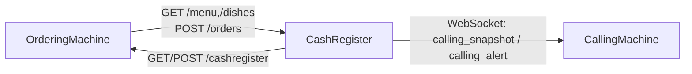

# 🍟 ComposeXPOS - Open Source Kotlin Multiplatform POS System

<div align="center">

A LAN-first **Compose Multiplatform POS Suite** for Android / iOS / Web.


</div>

ComposeXPOS is an open-source **restaurant POS system** built with **Kotlin Multiplatform** and **Compose Multiplatform**.
It provides a complete **self-order kiosk + cashier + pickup calling screen** workflow for **Android, iOS, and Web** deployments.

## 🔍 Keywords

`Kotlin Multiplatform POS`, `Compose Multiplatform POS`, `Open Source POS`, `Restaurant POS`, `Self-Order Kiosk`, `Cash Register App`, `Pickup Calling Screen`, `LAN POS System`, `Android POS`, `iOS POS`, `Web POS`

## Table of Contents

- [Overview](#overview)
- [Features](#features)
- [Use Cases](#use-cases)
- [Modules](#modules)
- [Architecture](#architecture)
- [Current Platform Targets](#current-platform-targets)
- [Quick Start](#quick-start)
- [iOS Host App (Xcode)](#ios-host-app-xcode)
- [LAN APIs and Protocols](#lan-apis-and-protocols)
- [Open-Source Safety Notes](#open-source-safety-notes)
- [Development Environment](#development-environment)
- [GitHub Pages Web Preview](#github-pages-web-preview)
- [Roadmap](#roadmap)
- [Contributing](#contributing)

## Overview

ComposeXPOS is a multi-device POS project with three apps and one shared module:

- `orderingMachine`: customer-facing kiosk
- `cashRegister`: cashier hub (orders, menu sync, call-number control)
- `callingMachine`: pickup calling display
- `shared`: cross-module protocols, models, and common capabilities

Current project mode: **open-source safe mode**. Payment and printing run in mock flows by default, with no production secrets in the repository.

## Features

- Multi-app POS workflow: kiosk ordering, cashier processing, and pickup calling display
- LAN-first local networking with HTTP/WebSocket for in-store deployments
- Kotlin Multiplatform codebase with Compose UI across Android, iOS, and Web
- Open-source-safe defaults: mock payment and mock printing flows
- Service-oriented module design for easier production adapter integration

## Use Cases

- Restaurant, cafe, and fast-food in-store ordering systems
- Self-service kiosk + cashier collaboration on local network
- Pickup number boards and kitchen-to-front-desk call coordination
- Reference architecture for Compose Multiplatform enterprise apps

## Modules

| Module | Role | Core Capabilities |
|---|---|---|
| `:orderingMachine` | Kiosk | Menu display, cart, checkout, payment flow (mock) |
| `:cashRegister` | Cashier hub | LAN API, order management, menu sync, calling integration |
| `:callingMachine` | Calling display | Real-time preparing/ready status board, alert linkage |
| `:shared` | Shared library | Protocol models, network constants, common logic |

## Architecture



## Current Platform Targets

- ✅ Android
- ✅ iOS
- ✅ Web

## Quick Start

### 1) Build Android

```bash
./gradlew :callingMachine:assembleDebug :cashRegister:assembleDebug :orderingMachine:assembleDebug
```

### 2) Run Web Dev Server

```bash
./gradlew :callingMachine:jsBrowserDevelopmentRun
./gradlew :cashRegister:jsBrowserDevelopmentRun
./gradlew :orderingMachine:jsBrowserDevelopmentRun
```

### 3) Build Web Distribution

```bash
./gradlew :callingMachine:jsBrowserDistribution
./gradlew :cashRegister:jsBrowserDistribution
./gradlew :orderingMachine:jsBrowserDistribution
```

### 4) Build iOS Frameworks (Simulator)

```bash
./gradlew :callingMachine:linkDebugFrameworkIosSimulatorArm64
./gradlew :cashRegister:linkDebugFrameworkIosSimulatorArm64
./gradlew :orderingMachine:linkDebugFrameworkIosSimulatorArm64
```

## iOS Host App (Xcode)

Use: `iosApp/iosApp.xcodeproj`

Shared schemes:

- `Calling` (`Debug-Calling`)
- `Cash` (`Debug-Cash`)
- `Ordering` (`Debug-Ordering`)

Related configs:

- `iosApp/Configuration/Config-Calling.xcconfig`
- `iosApp/Configuration/Config-Cash.xcconfig`
- `iosApp/Configuration/Config-Ordering.xcconfig`

## LAN APIs and Protocols

### CashRegister API

- `GET /health`
- `GET /dishes`
- `GET /menu`
- `POST /orders`

### OrderingMachine Config API

- `GET /health`
- `GET /cashregister`
- `POST /cashregister`
- Header auth: `X-Posroid-Key: <POSROID_LINK_SHARED_KEY>`

### CallingMachine WebSocket

- Viewer: `?mode=viewer`
- Source:
  - `?mode=source&key=<CALLING_WS_SHARED_KEY>`
  - `?ts=<millis>&sig=<sha256>`

Default placeholder key location:

- `shared/src/commonMain/kotlin/com/cofopt/shared/network/PosroidLinkProtocol.kt`

## Open-Source Safety Notes

- Firebase dependencies and config have been removed from this repository.
- Never commit real certificates, keys, merchant credentials, or production endpoints.
- Replace placeholder configs through secure runtime injection in production environments.

Production payment/printing integration reference:

- `docs/OPEN_SOURCE_PAYMENT_PRINTING.md`

## Development Environment

- JDK 17+
- Android SDK (`sdk.dir` configured in local `local.properties`)
- Xcode (required only when building the iOS host app)

## GitHub Pages Web Preview

This repo includes a workflow at:

- `.github/workflows/deploy-web.yml`

It automatically builds and deploys all web apps to GitHub Pages on every push to `main`:

- `orderingMachine`
- `orderingMachine-1` (same build as orderingMachine)
- `orderingMachine-2` (same build as orderingMachine)
- `cashRegister`
- `callingMachine`

### Enable once in GitHub

1. Open your repo on GitHub.
2. Go to **Settings → Pages**.
3. In **Build and deployment**, set **Source = GitHub Actions**.

After the first successful run, preview URLs will be:

- Home: `https://<your-github-username>.github.io/ComposeXPOS/`
- OrderingMachine: `https://<your-github-username>.github.io/ComposeXPOS/orderingMachine/`
- OrderingMachine Instance 1: `https://<your-github-username>.github.io/ComposeXPOS/orderingMachine-1/`
- OrderingMachine Instance 2: `https://<your-github-username>.github.io/ComposeXPOS/orderingMachine-2/`
- CashRegister: `https://<your-github-username>.github.io/ComposeXPOS/cashRegister/`
- CallingMachine: `https://<your-github-username>.github.io/ComposeXPOS/callingMachine/`

## Roadmap

- [ ] Production-grade payment gateway adapter
- [ ] Production-grade printing channels (USB/IP/vendor SDK)
- [ ] End-to-end integration testing and CI hardening
- [ ] Multi-device deployment and key-rotation automation

## Contributing

Pull requests and issues are welcome.

Recommended local check before submitting:

```bash
./gradlew :callingMachine:compileDebugKotlinAndroid :cashRegister:compileDebugKotlinAndroid :orderingMachine:compileDebugKotlinAndroid
```
