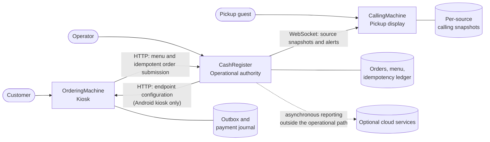
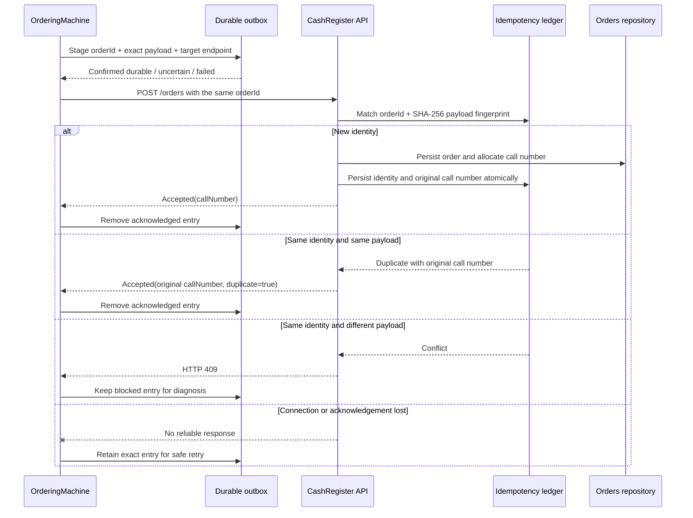
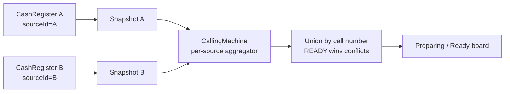

# 🍟 ComposeXPOS - Open-Source Compose Multiplatform POS

<div align="center">

A LAN-first restaurant POS suite for Android, iOS, and Web.


</div>

ComposeXPOS is an open-source restaurant POS system built with Kotlin Multiplatform and Compose Multiplatform. It provides a self-order kiosk, a cashier hub, and a pickup calling display that can cooperate over a store LAN without requiring a cloud broker for the operational path.

> [!IMPORTANT]
> This repository ships in open-source safe mode. Payment and printing are mock integrations, card payment is disabled by default, and all bundled shared keys are placeholders. Replace the adapters, secrets, and transport security before a production deployment.

## Live Preview

- Home: [https://composexpos.site/](https://composexpos.site/)
- OrderingMachine Instance A: [https://composexpos.site/orderingMachine/](https://composexpos.site/orderingMachine/)
- OrderingMachine Instance B: [https://composexpos.site/orderingMachine-1/](https://composexpos.site/orderingMachine-1/)
- CashRegister: [https://composexpos.site/cashRegister/](https://composexpos.site/cashRegister/)
- CallingMachine: [https://composexpos.site/callingMachine/](https://composexpos.site/callingMachine/)

The static preview demonstrates the user interfaces. Browser security policies and the absence of a public LAN gateway mean that every device-to-device networking feature cannot be exercised directly from GitHub Pages.

## Table of Contents

- [Overview](#overview)
- [Features](#features)
- [Use Cases](#use-cases)
- [Repository Modules](#repository-modules)
- [Architecture Design](#architecture-design)
  - [System Context](#system-context)
  - [Layering and Responsibilities](#layering-and-responsibilities)
  - [Order Submission and Recovery](#order-submission-and-recovery)
  - [Calling State Synchronization](#calling-state-synchronization)
  - [Payment Safety Boundary](#payment-safety-boundary)
  - [Persistence and Consistency](#persistence-and-consistency)
  - [Reliability Invariants](#reliability-invariants)
- [Why Local-First](#why-local-first)
- [Platform Targets](#platform-targets)
- [Quick Start](#quick-start)
- [iOS Host App](#ios-host-app)
- [LAN APIs and Protocols](#lan-apis-and-protocols)
- [Connection and Deployment Guide](#connection-and-deployment-guide)
- [Security and Production Readiness](#security-and-production-readiness)
- [Development Environment](#development-environment)
- [GitHub Pages Deployment](#github-pages-deployment)
- [Roadmap](#roadmap)
- [Contributing](#contributing)

## Overview

The runtime is split into three independently deployable applications and one shared protocol module:

- `orderingMachine` is the customer-facing kiosk. It reads the menu, creates a stable order identity, coordinates checkout, and durably retains orders whose acknowledgement may have been lost.
- `cashRegister` is the operational authority. It accepts LAN orders, assigns call numbers, stores order history, manages dishes, and publishes queue state to calling displays.
- `callingMachine` is the pickup display. It receives snapshots and alerts from one or more cashier sources and renders the combined preparing/ready state.
- `shared` contains serialized network models, link constants, validation rules, shared payment interfaces, and printing helpers.

The design favors explicit failure states over optimistic assumptions. A timeout does not mean that an order failed, an unreadable store does not mean that it is empty, and an unknown payment result is neither success nor decline.

## Features

- Self-order kiosk, cashier workflow, and pickup number board
- Compose UI shared across Android, iOS, JavaScript, and WebAssembly targets
- LAN-first HTTP and WebSocket communication
- Android DNS-SD/NSD discovery with manual endpoint fallback
- Durable kiosk outbox with endpoint binding, retry leases, and exponential backoff
- Cashier-side payload validation and durable order idempotency ledger
- Multi-cashier calling snapshots isolated by stable source identity
- Fail-closed persistence and explicit degraded-state reporting
- Mock payment and printing adapters for safe development and CI
- TLS reverse-proxy support for browser-to-device deployments

## Use Cases

- Restaurant, cafe, and fast-food in-store ordering
- Self-service kiosk and cashier collaboration on a private network
- Kitchen/front-desk pickup number coordination
- Offline-tolerant store operation with optional asynchronous cloud reporting
- A reference implementation for communication and recovery patterns in Compose Multiplatform applications

## Repository Modules

| Gradle module | Runtime role | Main responsibilities |
|---|---|---|
| `:orderingMachine` | Customer kiosk | Menu, cart, checkout, durable order outbox, payment state machine, printing facade |
| `:cashRegister` | Cashier and LAN authority | HTTP API, menu storage, order acceptance, call-number allocation, idempotency, calling bridge |
| `:callingMachine` | Pickup display | WebSocket server/client integration, per-source snapshots, preparing/ready board, alerts |
| `:shared` | Shared library | Wire models, validation, connection constants, payment interfaces, print formatting |

Each application follows the Kotlin Multiplatform source-set model:

```text
<module>/src/
├── commonMain/       shared UI, state, models, and business rules
├── androidMain/      Android services, NSD, storage, sockets, and hardware adapters
├── iosMain/          iOS bridges, persistence, and networking adapters
├── jsMain|webMain/   browser adapters and entry points
├── wasmJsMain/       WebAssembly adapters
└── *Test/            common and platform-specific tests
```

## Architecture Design

### System Context


```mermaid
flowchart LR
    Customer([Customer]) --> OM["OrderingMachine<br/>Kiosk"]
    Operator([Operator]) --> CR["CashRegister<br/>Operational authority"]
    Guest([Pickup guest]) --> CM["CallingMachine<br/>Pickup display"]

    OM -->|"HTTP: menu and idempotent order submission"| CR
    CR -->|"HTTP: endpoint configuration<br/>(Android kiosk only)"| OM
    CR -->|"WebSocket: source snapshots and alerts"| CM

    OM --- OStore[("Outbox and<br/>payment journal")]
    CR --- CStore[("Orders, menu,<br/>idempotency ledger")]
    CM --- MStore[("Per-source<br/>calling snapshots")]

    Cloud[("Optional cloud services")]
    CR -. "asynchronous reporting<br/>outside the operational path" .-> Cloud
```

The normal operational path is `OrderingMachine -> CashRegister -> CallingMachine`. CashRegister is the authority for order acceptance and call-number allocation. CallingMachine is a projection of cashier state, not an order database. Optional cloud services are intentionally outside the real-time path.

### Layering and Responsibilities

| Layer | Responsibility | Representative components |
|---|---|---|
| Presentation | Compose screens, navigation, operator/customer feedback | App composables, payment screens, calling board |
| Application | State transitions and use-case coordination | View models, calling reconciler, payment state machine |
| Domain/protocol | Stable payloads, validation, result types, invariants | `OrderPayload`, submission results, link protocol |
| Persistence | Durable intent, snapshots, menu/order state, recovery journals | Order outbox, `OrdersRepository`, idempotency ledger, platform preferences |
| Transport | HTTP, WebSocket, discovery, endpoint normalization | LAN server, network transports, calling bridge, NSD/probes |
| Platform adapters | OS-specific storage, services, browser APIs, hardware facades | Android/iOS/Web implementations and mock provider adapters |

Platform code implements transport and persistence details; business decisions stay in common or narrowly scoped application code. This keeps protocol semantics consistent even when Android, iOS, JavaScript, and WebAssembly use different underlying APIs.

### Order Submission and Recovery

OrderingMachine treats order delivery as an idempotent, recoverable workflow rather than a single request:


```mermaid
sequenceDiagram
    participant K as OrderingMachine
    participant O as Durable outbox
    participant C as CashRegister API
    participant L as Idempotency ledger
    participant R as Orders repository

    K->>O: Stage orderId + exact payload + target endpoint
    O-->>K: Confirmed durable / uncertain / failed
    K->>C: POST /orders with the same orderId
    C->>L: Match orderId + SHA-256 payload fingerprint
    alt New identity
        C->>R: Persist order and allocate call number
        C->>L: Persist identity and original call number atomically
        C-->>K: Accepted(callNumber)
        K->>O: Remove acknowledged entry
    else Same identity and same payload
        L-->>C: Duplicate with original call number
        C-->>K: Accepted(original callNumber, duplicate=true)
        K->>O: Remove acknowledged entry
    else Same identity and different payload
        L-->>C: Conflict
        C-->>K: HTTP 409
        K->>O: Keep blocked entry for diagnosis
    else Connection or acknowledgement lost
        C--xK: No reliable response
        K->>O: Retain exact entry for safe retry
    end
```

Key behavior:

- A newly staged order captures an atomic `host + port` endpoint snapshot. Later configuration changes do not redirect an existing order to a different cashier.
- The version 4 outbox stores one order per persistence key, avoiding lost updates when browser tabs stage different orders concurrently.
- The foreground checkout performs one short submission attempt; the retry loop handles transient failures with a lease, bounded exponential backoff, and round-robin selection across endpoints.
- Retryable ambiguous outcomes preserve the same `orderId` and payload. CashRegister can therefore return the original call number without creating a duplicate order.
- Permanent client errors are blocked instead of retried forever. HTTP `408`, `425`, and `429` remain transient.

Submission results are deliberately distinct:

| Result | Meaning | Side-effect policy |
|---|---|---|
| `Accepted(callNumber)` | CashRegister acknowledged the identity and returned its authoritative call number | Complete the order and remove/commit the outbox entry as appropriate |
| `Pending(orderId)` | The exact durable intent exists, but acknowledgement is missing or delivery is deferred | Background retry is safe |
| `Indeterminate(orderId)` | Durability cannot be proven | Freeze the identity and do not start payment or network side effects |
| `Rejected(status, message)` | A definite configuration, validation, conflict, or permanent client failure occurred | Do not silently retry; expose the reason |

CashRegister retains its idempotency ledger independently from visible order history. Deleting or archiving an order in the UI does not allow a delayed kiosk retry to acquire a new call number. The default ledger is bounded to 20,000 identities and 180 days; retention is measured from original server acceptance, not the latest retry.

### Calling State Synchronization

CashRegister publishes two WebSocket message types:

- `calling_snapshot` replaces the current preparing/ready projection for one stable `sourceId`.
- `calling_alert` requests attention for a call number without granting permission to overwrite queue state.


```mermaid
flowchart LR
    CR1["CashRegister A<br/>sourceId=A"] --> S1["Snapshot A"]
    CR2["CashRegister B<br/>sourceId=B"] --> S2["Snapshot B"]
    S1 --> AGG["CallingMachine<br/>per-source aggregator"]
    S2 --> AGG
    AGG --> RULE["Union by call number<br/>READY wins conflicts"]
    RULE --> BOARD["Preparing / Ready board"]
```

Snapshots are scoped by source so one cashier cannot erase another cashier's numbers. Reconnecting with the same stable `sourceId` replaces that source's previous snapshot. A transient disconnect retains the last snapshot instead of making active numbers disappear. Source storage is bounded to prevent untrusted identities from growing memory indefinitely.

CashRegister also reconciles order state with its calling projection. Suppression/tombstone state prevents a number that an operator deliberately removed or cleared from immediately reappearing during reconciliation.

### Payment Safety Boundary

The bundled WECR HTTPS/TCP clients are explicit mock adapters. Real card payment is unavailable unless the operator enables both payment and the debug payment state machine. Production integration requires replacing the adapter and validating the complete terminal workflow on real hardware.

Android OrderingMachine uses two coordinated durable records:

- The order outbox reserves the order identity and target before an external payment request.
- `CardPaymentJournal` records `PREPARED`, `START_REQUESTED`, and `ACTIVE` phases so restart recovery can distinguish "not started" from "may have started".

Outbox payment phases prevent unsafe global retry:

| Outbox phase | Meaning | Global order retry |
|---|---|---|
| `NONE` | Ordinary deliverable order | Allowed when due |
| `PREPARED` | Identity reserved for a card attempt | Not allowed |
| `PAID_COMMIT` | Payment confirmed; paid order is being durably committed | Held until journal/outbox reconciliation safely releases it |

If the terminal outcome is unknown, the kiosk locks the payment flow and recovers the existing transaction reference; it does not start another payment. A paid order that cannot reach CashRegister remains durable. A permanent server rejection is retained as a blocked paid record for operator resolution rather than being discarded or retried forever.

### Persistence and Consistency

| Owner | Durable state | Consistency rule |
|---|---|---|
| OrderingMachine | Per-order outbox entries | Exact identity, payload, payment phase, and original endpoint remain bound across retries |
| OrderingMachine Android | Card payment journal | Written before and around external terminal calls; unknown phases fail toward recovery |
| CashRegister | Orders and repository metadata | Thread-safe snapshots; corrupted/unreadable state reports failure instead of empty success |
| CashRegister | Idempotency ledger | Persisted with order state; separate from operator-visible history |
| CashRegister | Calling projection and suppressions | Reconciled from orders while preserving deliberate operator removals |
| CallingMachine | Per-source snapshots | Stable source identity, bounded storage, deterministic aggregate |

Persistence APIs distinguish confirmed writes, uncertain writes with exact read-back, and failed writes. This distinction is important: a reported storage failure may still have written the exact value, while an unreadable result cannot safely authorize payment or delivery.

### Reliability Invariants

The following invariants define the architecture and should remain true when adding transports or platform adapters:

1. The same logical order keeps the same `orderId` and exact payload across every retry.
2. A staged order remains bound to its original CashRegister endpoint.
3. Only CashRegister allocates authoritative call numbers; clients never fabricate one after a timeout.
4. UI deletion is independent from network idempotency retention.
5. Corrupt or unreadable persistence fails closed and is never interpreted as an empty store.
6. Payment with an unknown outcome blocks a second attempt until the original transaction is resolved.
7. Card-reserved orders never enter the ordinary background retry loop.
8. Calling snapshots are isolated by stable `sourceId`; `READY` wins when sources disagree.
9. Viewer WebSocket clients are read-only and cannot publish queue state.
10. A configuration update affects future orders only; it cannot reroute an in-flight identity.

## Why Local-First

ComposeXPOS keeps critical store operations on the local network because it provides:

- lower and more predictable latency for orders and calling updates;
- continued operation during internet degradation or outage;
- less dependence on guest Wi-Fi, mobile carriers, or external message brokers;
- a smaller external dependency and recurring-cost footprint for the real-time path.

Local-first does not mean cloud-free. Central reporting, backups, fleet management, and cross-store analytics remain good cloud use cases, but they should synchronize asynchronously and should not be required to accept a local order.

## Platform Targets

| Target | UI | LAN/discovery notes |
|---|---|---|
| Android | Compose for Android | Native HTTP/WebSocket services, DNS-SD/NSD discovery, background services, hardware adapter entry points |
| iOS | Compose Multiplatform hosted by Xcode | Platform networking and persistence bridges; uses manual or configured endpoints where native discovery is unavailable |
| JavaScript | Compose HTML/Canvas target | Browser networking restrictions apply; manual endpoints and active probes are used |
| WebAssembly | Compose Wasm target | Same browser security boundary as JavaScript; build distributions separately |

## Quick Start

### Prerequisites

- JDK 17 or newer
- Android SDK for Android builds
- Xcode for the iOS host app

### Build Android

```bash
./gradlew :callingMachine:assembleDebug :cashRegister:assembleDebug :orderingMachine:assembleDebug
```

### Run JavaScript Development Servers

Run each command in a separate terminal:

```bash
./gradlew :callingMachine:jsBrowserDevelopmentRun
./gradlew :cashRegister:jsBrowserDevelopmentRun
./gradlew :orderingMachine:jsBrowserDevelopmentRun
```

### Build JavaScript Distributions

```bash
./gradlew :callingMachine:jsBrowserDistribution
./gradlew :cashRegister:jsBrowserDistribution
./gradlew :orderingMachine:jsBrowserDistribution
```

CashRegister production minification is intentionally disabled in `cashRegister/webpack.config.d/disable-production-minification.js` because the current Terser step can stall on the generated bundle. The resulting artifact is larger but deterministic to build.

### Build WebAssembly Distributions

Build one application at a time with a single Gradle worker to reduce peak JVM memory pressure:

```bash
./gradlew :callingMachine:wasmJsBrowserDistribution --max-workers=1
./gradlew :cashRegister:wasmJsBrowserDistribution --max-workers=1
./gradlew :orderingMachine:wasmJsBrowserDistribution --max-workers=1
```

### Build iOS Frameworks for Apple Silicon Simulator

```bash
./gradlew :callingMachine:linkDebugFrameworkIosSimulatorArm64
./gradlew :cashRegister:linkDebugFrameworkIosSimulatorArm64
./gradlew :orderingMachine:linkDebugFrameworkIosSimulatorArm64
```

### Run Tests and Android Lint

```bash
./gradlew :shared:testDebugUnitTest :callingMachine:testDebugUnitTest :cashRegister:testDebugUnitTest :orderingMachine:testDebugUnitTest
./gradlew :callingMachine:lintDebug :cashRegister:lintDebug :orderingMachine:lintDebug
```

## iOS Host App

Open `iosApp/iosApp.xcodeproj` in Xcode.

Shared schemes:

- `Calling` with `Debug-Calling`
- `Cash` with `Debug-Cash`
- `Ordering` with `Debug-Ordering`

Related configurations:

- `iosApp/Configuration/Config-Calling.xcconfig`
- `iosApp/Configuration/Config-Cash.xcconfig`
- `iosApp/Configuration/Config-Ordering.xcconfig`

## LAN APIs and Protocols

### CashRegister HTTP API

| Method | Path | Purpose |
|---|---|---|
| `GET` | `/health` | Liveness and discovery probe |
| `GET` | `/dishes` | Dish data retrieval |
| `GET` | `/menu` | Menu synchronization |
| `POST` | `/orders` | Validated, idempotent order submission |

`POST /orders` validates identity, timestamps, totals, item counts, quantities, prices, and bounded string fields before acceptance. A repeated `orderId` with the same payload returns the original result; the same identity with a different payload returns a conflict.

### OrderingMachine Discovery and Configuration API

| Method | Path | Purpose |
|---|---|---|
| `GET` | `/health` | Liveness probe |
| `GET` | `/composexpos-ordering.json` | Browser-friendly discovery metadata |
| `GET` | `/cashregister` | Read the configured CashRegister endpoint |
| `POST` | `/cashregister` | Update the endpoint on Android OrderingMachine |

Configuration writes require:

```text
X-ComposeXPOS-Key: <COMPOSEXPOS_LINK_SHARED_KEY>
```

The request body may also carry `sharedKey`. Web OrderingMachine instances do not expose the configuration write API; CashRegister may still select them as communication targets.

### CallingMachine WebSocket Protocol

- Viewer: `?mode=viewer`
- Source: `?mode=source&key=<CALLING_WS_SHARED_KEY>&sourceId=<stable-device-id>`
- Optional source hardening: `&ts=<millis>&sig=<sha256>`

The optional signature is calculated as:

```text
sha256("CALLING_WS_V1|<ts>|<CALLING_WS_SHARED_KEY>")
```

Supported source events are `calling_snapshot` and `calling_alert`. Viewer connections receive state but cannot publish it.

Default placeholder keys are defined in:

```text
shared/src/commonMain/kotlin/com/cofopt/shared/network/ComposeXPOSLinkProtocol.kt
```

## Connection and Deployment Guide

### Discovery by Platform

Android CashRegister uses DNS-SD/NSD to discover:

- `_composexpos-ordering._tcp.`
- `_composexpos-calling._tcp.`

Android OrderingMachine and CallingMachine advertise their services. Manual host and port overrides remain available for diagnostics and networks where multicast discovery is disabled.

Browsers do not expose native DNS-SD. Web CashRegister therefore combines saved/manual endpoint hints, current-page and loopback candidates, common development ports, LAN probes, and WebRTC-assisted address hints when available. Discovery is best-effort; manual connection is the reliable fallback.

### Default Ports

| Service | Common default |
|---|---:|
| CashRegister LAN HTTP API | `8080` |
| CallingMachine WebSocket server | `9090` |
| Android OrderingMachine discovery/configuration server | `19081` |
| Public HTTPS/WSS reverse proxy | `443` |

Web development instances may use `19082`, `3000`, `3001`, `4173`, `5173`, `5174`, or another port selected by the development server. Always treat `scheme + host + port` as the endpoint identity. IPv4, IPv6, `http`/`https`, and `ws`/`wss` endpoint forms are supported where the platform transport allows them.

### Localhost and Multiple Instances

`localhost` always names the device running the current application. Use the target device's LAN address when applications run on different devices. Multiple instances on one host must use distinct ports or distinct reverse-proxy hostnames.

### Browser Security Boundary

An HTTPS page can be blocked from opening raw `http://` or `ws://` device endpoints by mixed-content and Private Network Access policies. For a stable browser deployment, terminate TLS at a reverse proxy:

```text
wss://call-store.example.com:443  -> ws://<calling-device-lan-ip>:9090
https://order-store.example.com:443 -> http://<ordering-device-lan-ip>:19081
```

CashRegister Web should use the public TLS hostnames. Keep endpoint authentication enabled through the proxy. GitHub Pages hosts static assets only and does not provide this gateway.

### Troubleshooting

| Symptom | Checks |
|---|---|
| `ERROR:network_unreachable` | Verify the target device address, port, client isolation rules, firewall, and incorrect use of `localhost` |
| `no /cashregister API` | Expected for Web OrderingMachine; remote configuration writes are Android-only |
| No services discovered on Android | Confirm devices share a multicast-capable LAN; use manual host/port if NSD is filtered |
| No services discovered on Web | Browser policies may block probes; enter an explicit HTTPS/WSS or permitted LAN target |
| HTTPS page cannot reach a LAN device | Use a TLS reverse proxy on `443` instead of mixed `http`/`ws` content |
| Duplicate submission returns `409` | The same `orderId` was reused with a different payload; preserve the original payload or create a new identity |
| Order stays pending | Inspect CashRegister reachability and the outbox blocked/retry state; do not create a replacement identity blindly |

Useful direct probes:

```text
http://<cash-register-host>:8080/health
http://<ordering-host>:19081/health
http://<ordering-host>:19081/composexpos-ordering.json
```

## Security and Production Readiness

The default LAN model is suitable for development and controlled networks, not an untrusted zero-trust environment.

Before production deployment:

1. Replace both `CHANGE_ME_*` shared keys and inject secrets outside version control.
2. Add key rotation, device enrollment, and revocation procedures.
3. Use TLS for traffic that crosses an untrusted network; plain LAN HTTP/WebSocket is not encrypted.
4. Replace the optional shared-key SHA-256 WebSocket signature with a reviewed authentication design if stronger replay and message-integrity guarantees are required.
5. Restrict the POS VLAN, firewall device ports, and disable client isolation only where operationally necessary.
6. Replace mock payment and printing adapters and run hardware end-to-end tests, including timeout, restart, duplicate, and unknown-outcome recovery.
7. Add production observability without logging credentials, card data, or unnecessary personal data.
8. Define backup, retention, and store recovery procedures for persistent order data.

No Firebase configuration, merchant credentials, production certificates, or vendor secrets are bundled. See [Open-Source Payment/Printing Integration Guide](docs/OPEN_SOURCE_PAYMENT_PRINTING.md) for adapter guidance.

## Development Environment

- JDK 17+
- Android SDK with `sdk.dir` configured in local `local.properties`
- Xcode for the iOS host application
- A multicast-capable local network for Android NSD tests
- A TLS reverse proxy for HTTPS browser-to-device integration tests

## GitHub Pages Deployment

The workflow at `.github/workflows/deploy-web.yml` builds and deploys:

- `orderingMachine`
- `orderingMachine-1` as a second kiosk instance
- `cashRegister`
- `callingMachine`

To enable deployment, open the repository's GitHub settings, select **Pages**, and set **Build and deployment -> Source** to **GitHub Actions**. The resulting URLs are listed in [Live Preview](#live-preview).

GitHub Pages serves static assets only. A separate TLS gateway is required when the hosted CashRegister must communicate with physical devices.

## Roadmap

- [ ] Production-grade payment provider adapter
- [ ] Production-grade printing transports for USB, IP, and vendor SDKs
- [ ] End-to-end multi-device fault-injection tests
- [ ] CI hardening across Android, iOS, JavaScript, and WebAssembly
- [ ] Secure device enrollment and automated key rotation
- [ ] Optional asynchronous cloud reporting and fleet management

## Contributing

Issues and pull requests are welcome. Changes to networking, persistence, or payment code should preserve the [Reliability Invariants](#reliability-invariants) and include tests for success, retry, timeout, duplicate, conflict, corrupt-storage, and restart paths as applicable.

Recommended checks before submitting:

```bash
./gradlew :shared:testDebugUnitTest :callingMachine:testDebugUnitTest :cashRegister:testDebugUnitTest :orderingMachine:testDebugUnitTest
./gradlew :callingMachine:lintDebug :cashRegister:lintDebug :orderingMachine:lintDebug
```

Never commit real certificates, shared keys, merchant identifiers, payment credentials, or production endpoints.
